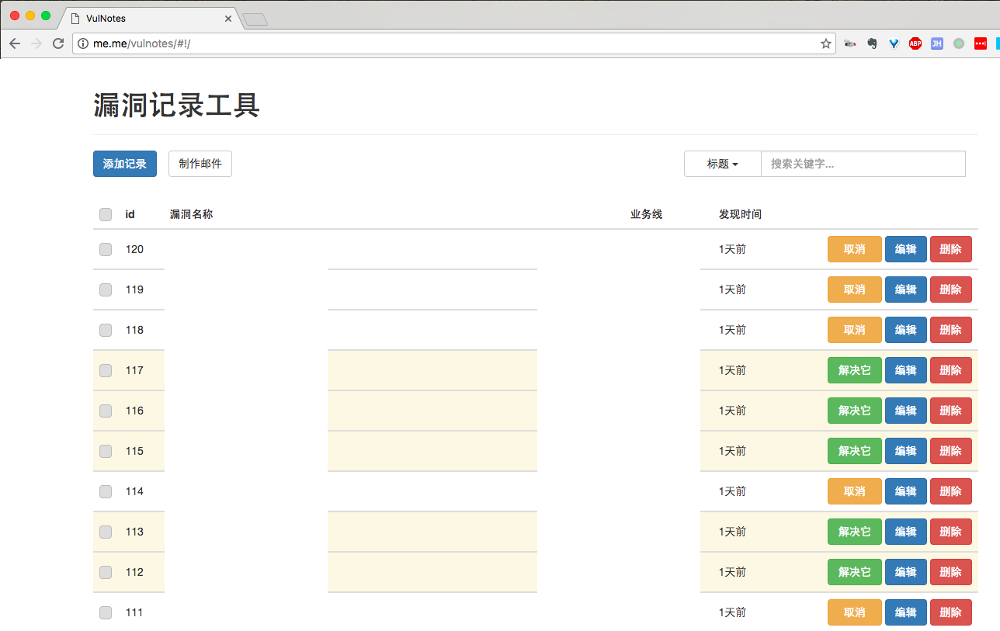

# VulNotes 漏洞记录工具

Vue 1.0 + Flask 编写的一个小记录工具。长这样：




## Usage

### Frontend

``` bash
# 前端项目在"frontend/"目录
# 安装依赖
npm install

# 变更PublicPath
# 若部署URL为http://a.b.com/vulnotes/, 则将PublicPath设置为'/vulnotes/'
change config/index.js: build: assetsPublicPath field

# bootstrap-datetimepicker
unzip frontend/static/bootstrap-datetimepicker-master.zip
mv frontend/static/bootstrap-datetimepicker-master frontend/node_modules/bootstrap-datetimepicker

# 测试环境 localhost:8080
npm run dev

# 生产环境, 生成文件在'./frontend/dist'
npm run build
```

### Backend

```bash
# 填写数据库信息
$ vim config.py

# 部署数据库
$ python web.py deploy

# 用gunicorn启动
$ ./run.sh
```

